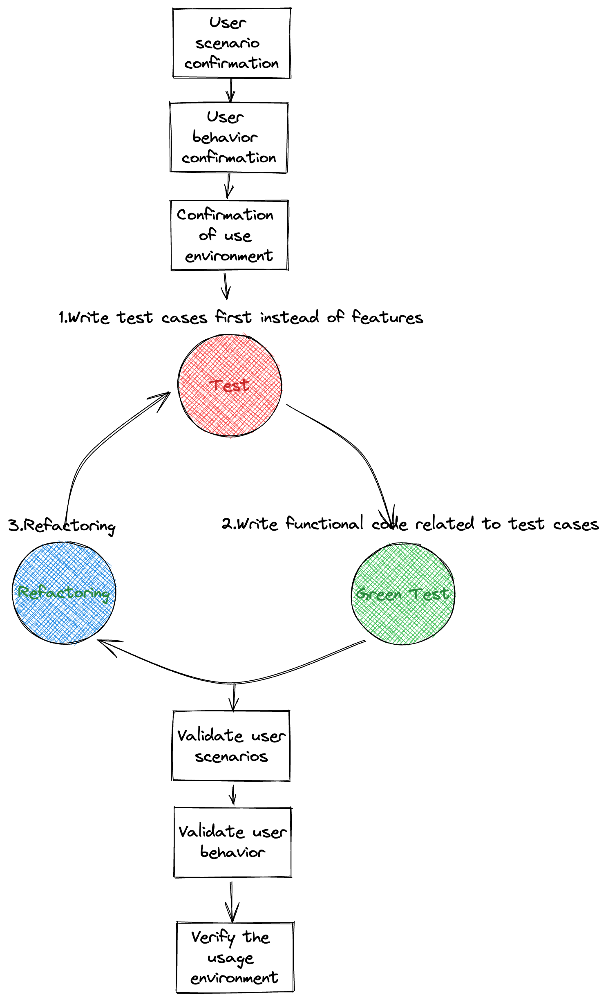
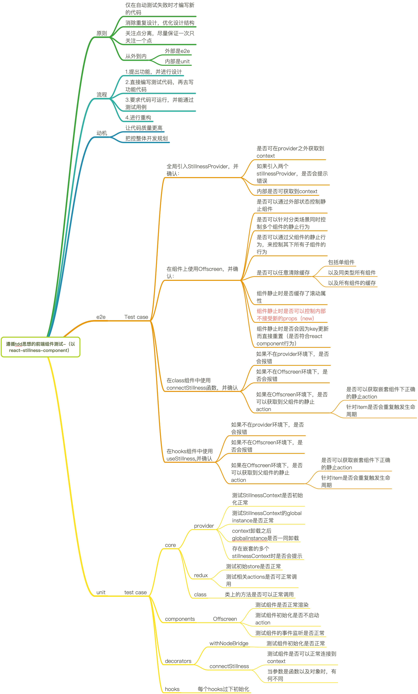

> Test-Driven Development(测试驱动开发,以下简述**TDD**)是一种设计方法论, 原理是在开发功能代码之前, 先编写单元测试用例代码, 通过测试来推动整个开发的进行.

本文详细描述了在创作 `react-stillness-component` 组件的过程中, 是如何学习 **TDD** 的思想来完成功能开发以及测试的.关于组件实现的原理以及细节,可以查看上一篇文章 《react 中如何实现 keep-alive 效果》

## 一.前言-自动化测试相关

本篇文章是针对编写`react`组件过程中所产生的质量与功能保障的角度去写的,由于涉及到部分的名词,可能需要提前有部分的自动化测试相关知识;

本文的侧重点主要是在如何设计以及为何要使用 tdd 的方式来做组件测试,有任何的问题,也欢迎与作者进行讨论 😁

## 二.我所认为的 tdd 实际落地流程

首先简单回顾一下 tdd:


对应的实际行为可能是([来源于 wiki](https://en.wikipedia.org/wiki/Test-driven_development))

1. 添加一个测试用例
2. 运行该测试用例,得到失败的结果(因为还没有实现任何功能)
3. 编写刚好能通过的最简单的代码
4. 重新运行该测试用例,得到成功的结果
5. 根据需要进行重构,并保证每次重构之后都能通过之前的测试用例
6. 重复这个步骤,直至完成整个开发

当然,在实际的开发过程中,作者也针对现实情况做了一定的改造,先看下改造之后的流程:



这里主要是针对前端组件场景增加了一些比较重要的步骤

- 确认用户场景,在什么样的情况下才考虑用到这个组件?包括了普通用户和专业用户涉及到的场景.需要考虑到涉及到 UI 框架的场景
- 确认用户行为,也就是用户的具体操作是什么?可以先从自身的角度出发,再进行实际调研,观察类似的组件是如何被使用的
- 确认用户环境,这里的环境包括了现代浏览器环境以及框架自身所处的开发环境.

在每次完成测试用例编写之前先是确认环节,保证功能不偏离初心;在每次测试完之后,再进行验证,而验证的手段可以是 BDD(后文会提到)也可以结合现实线上例子进行结合考虑,如果可以解决实际问题,则证明功能已完成.

当然,由于作者本身的日常习惯是先列计划 😂,这次也不例外:



可以看到最下面的部分就是与 TDD 相关的测试用例规划,实际编写用例过程中会有额外的情况,因此第二个部分也就是 e2e 模拟测试就是框定的使用范围,第一期只要不超出即可.

下面来看实际案例

## 三.实际案例

> 本文中使用的测试框架为**[jest](https://jestjs.io/)**,相关配置可参考问题汇总的第一点

### provider

首先从最外层开始,该组件内部大量使用了`context`,因此,需要提供一个全局的`provider`,因为`provider`的`value`来源于`createStillnessManager()`,所以我们的第一个例子就是判断当提供了这个方法的时候,`provider`是否可以正常运行

```js
it('Verify that the StillnessManager is correct', () => {
  let capturedManager;
  let manager = createStillnessManager(); // let mockManager: any = jest.fn();

  render(
    <StillnessContext.Provider value={{ stillnessManager: manager }}>
      <StillnessContext.Consumer>
        {({ stillnessManager }) => {
          capturedManager = stillnessManager;
          return null;
        }}
      </StillnessContext.Consumer>
    </StillnessContext.Provider>
  );

  expect(capturedManager).toBe(manager);
});
```

这里前期使用的其实是`jest mock functions`,当`createStillnessManager()`编写完成之后,才被替换成真实的函数,两者的区别在于`mock`的方式可以过滤掉`provider`编写代码时的干扰项

那我们现在就可以开始 `run test` 了,当然,这时由于代码已编写完毕,无论是使用真实的参数还是模拟的参数都可以得到成功的例子.

而在一开始,未编写代码时,就可以遵循流程,编写真实代码了.

`provider`除了初始化之外,当然还会有其他功能,比如:

- 卸载时会自动清除全局的缓存对象
- 预防多个 provider 嵌套产生的错误,需要主动提醒用户

而针对这两点,我们就可以继续写测试用例了

```js
it('stores StillnessManager in global context and cleans up on unmount', () => {
  let capturedManager;

  const { container, unmount } = render(
    <StillnessProvider>
      <StillnessContext.Consumer>
        {({ stillnessManager }) => {
          capturedManager = stillnessManager;
          return null;
        }}
      </StillnessContext.Consumer>
    </StillnessProvider>
  );

  const globalInstance = () => (global as any)[INSTANCE_SYM] as any;

  expect(globalInstance().stillnessManager).toEqual(capturedManager);
  unmount();
  expect(globalInstance()).toEqual(null);
});
```

可以看到,这里通过调用返回的方法,从而达到了模拟卸载的效果.

### class Component

首先来看下整个库的核心, `<OffscreeenComponent>`,相比较经过`HOC`包装之后的组件,原始组件的 props 就要复杂的多了

- uniqueId: UniqueId;
- parentId: UniqueId;
- parentIsStillness: boolean;
- isStillness: boolean;
- stillnessManager: StillnessManager;

测试用例也围绕这几点即可,举个例子:

```js
it('Does it prompt an error message when there is no context?', () => {
  global.console.error = jest.fn();

  expect(() => {
    render(
      <OffscreenComponent
        visible={true}
        isStillness={false}
        uniqueId="test1"
        parentId={rootId}
        parentIsStillness={false}
      >
        <div />
      </OffscreenComponent>
    );
  }).toThrow(/stillnessManager is required/i);
});
```

组件是没办法在缺少 `context` 的情况下运行的,那我们在编写例子的时候只要排除这个参数就行,如果组件捕获了异常并抛出了,则说明功能是 ok 的,这个属于较为简单的例子

来看一个更加复杂的:

```js
it('When the passed isStillness changes, clear the corresponding dom element or reload the original one', async () => {
  const Demo = ({ isStillness }: any) => {
    return (
      <OffscreenComponent
        visible={true}
        isStillness={isStillness}
        uniqueId="test1"
        stillnessManager={mockStillnessManager()}
        parentId={rootId}
        parentIsStillness={false}
      >
        <div data-testid="content" />
      </OffscreenComponent>
    );
  };

  const { queryByTestId, rerender } = render(<Demo isStillness={false} />);

  rerender(<Demo isStillness={true} />);
  expect(queryByTestId('content')).not.toBeInTheDocument();

  rerender(<Demo isStillness={false} />);
  expect(queryByTestId('content')).toBeInTheDocument();
});
```

组件的`isStillness`属性是比较重要的,也是用来控制组件的静止与否的条件,在这里通过真实模拟`render`,并通过修改传参的方法,来直接模拟效果,如果传递了`true`,则组件应该会渲染在 `body` 中,也就是查找`id`为`content`的元素一定可以找到,反之就找不到.

通过这种方法,就可以测试 `class Component`

更多例子请参考 [Offscreen.spec.tsx](https://github.com/leomYili/react-stillness-component/blob/main/packages/react-stillness/src/components/__tests__/Offscreen.spec.tsx)

### HOC

`HOC`是如何进行测试的呢,以`<Offscreen>`组件为例:

其 `props` 为:

- visible:boolean 类型,控制组件是否静止
- type:string or number,标识组件的类型,可重复,同一类型的静止行为会保持一致
- scrollRest:boolean 类型,控制组件静止时是否缓存滚动位置

但这些`props`实际上是经过处理传递给`<OffscreenComponent>`组件的,

对于`HOC`自身来说,只需要保证在未找到`context`时进行捕获异常即可:

```js
it('throw an error if rendered', () => {
  console.error = jest.fn();

  class TestClass extends React.Component<
    React.PropsWithChildren<OffscreenInnerProps>
  > {}

  const DecoratedClass = withNodeBridge(TestClass);

  expect(() => {
    render(<DecoratedClass visible />);
  }).toThrow(/Expected stillness component context/);
});
```

至于上面的`props`,由于涉及到了其他模块,属于`BDD`测试的范畴了,会在下一篇 BDD 测试相关进行介绍

### hooks

针对`hooks`相关,需要用到 [@testing-library/react-hooks](https://github.com/testing-library/react-hooks-testing-library) 该库可以直接运行 hooks 并断言结果

举例说明:

现在有一个根据依赖项从而返回最新结果的 hooks `useOptionalFactory`

代码为:

```js
function useOptionalFactory<T>(
  arg: FactoryOrInstance<T>,
  deps?: unknown[]
): T {
  const memoDeps = [...(deps || [])];
  if (deps == null && typeof arg !== 'function') {
    memoDeps.push(arg);
  }
  return useMemo<T>(() => {
    return typeof arg === 'function' ? (arg as () => T)() : (arg as T);
  }, memoDeps);
}
```

测试用例的代码为:

```js
import { renderHook, act } from '@testing-library/react-hooks';

const useTest = () => {
  const [count, setCount] = React.useState(0);

  const addCount = () => {
    setCount(count + 1);
  };

  const optionFactoryFn = useOptionalFactory(
    () => ({
      collect: () => {
        return {};
      },
    }),
    [count]
  );

  return { addCount, optionFactoryFn };
};

describe('useOptionalFactory', () => {
  let hook;
  it('Depending on the variation of the dependency value, different results are generated', () => {
    act(() => {
      hook = renderHook(() => useTest());
    });

    let memoValue = hook.result.current.optionFactoryFn;

    act(() => {
      hook.result.current.addCount();
    });

    expect(memoValue).not.toStrictEqual(hook.result.current.optionFactoryFn);
  });
});
```

通过使用 `renderHooks()` 与 `act()`,即可简单进行测试,当测试的依赖项变化时,返回值则跟随进行变化.

## 四.问题汇总

1. 如何搭建测试环境?

    整体架构为`lerna+Typescript+React+rollup+Jest`,其实社区也有了很多的实例了,这里只介绍搭建过程中遇到的问题,

    - 如何单独搭建子包的测试环境?
      lerna 的架构,很好的分离了每个包的环境,可以使用不同的测试框架在每个子包中,单独配置,举例:
      
      可以在每个包中配置不同的 **jest.config**
    - 测试代码也希望使用`Typescript`?

      ```js
      // jest-transformer.js
      const babelJest = require('babel-jest');

      module.exports = babelJest.createTransformer({
        presets: [
          [
            '@babel/preset-env',
            {
              targets: {
                node: 'current',
                esmodules: true,
              },
              bugfixes: true,
              loose: true,
            },
          ],
          '@babel/preset-typescript',
        ],
        plugins: [
          ['@babel/plugin-proposal-class-properties', { loose: true }],
          '@babel/plugin-transform-react-jsx',
          ['@babel/plugin-proposal-private-methods', { loose: true }],
          [
            '@babel/plugin-proposal-private-property-in-object',
            { loose: true },
          ],
          '@babel/plugin-proposal-object-rest-spread',
          '@babel/plugin-transform-runtime',
        ],
      });

      //jest.config.js
      module.exports = {
        setupFilesAfterEnv: ['./jest-setup.ts'],
        testMatch: ["**/__tests__/**/?(*.)(spec|test).[jt]s?(x)"],
        // testRegex: 'decorateHandler.spec.tsx',
        transform: {
          "\\.[jt]sx?$": "./jest-transformer.js",
        },
        collectCoverageFrom: [
          '**/src/**/*.tsx',
          '**/src/**/*.ts',
          '!**/__tests__/**',
          '!**/dist/**',
        ],
        globals: {
          __DEV__: true,
        },
      };
      ```

      只需要增加transform配置即可

2. 如何测试实际的渲染效果?

    可使用 [`@testing-library/jest-dom`](https://github.com/testing-library/jest-dom),该库提供了关于 `DOM` 状态的相关 `jest` 匹配器,可用来检查元素的树形,文本,样式等,本文也介绍了一些,比如:

    - toBeInTheDocument:判断文档中是否存在元素
    - toHaveClass:判断给定元素中是否在其class属性中具有相应的类名
    - toBeVisible:判断给定元素是否对用户可见

3. 想要单独测试某一个例子怎么办?

    ```js
    //jest.config.js
    module.exports = {
      setupFilesAfterEnv: ['./jest-setup.ts'],
      //testMatch: ["**/__tests__/**/?(*.)(spec|test).[jt]s?(x)"],
      testRegex: 'decorateHandler.spec.tsx',
      transform: {
        "\\.[jt]sx?$": "./jest-transformer.js",
      },
      collectCoverageFrom: [
        '**/src/**/*.tsx',
        '**/src/**/*.ts',
        '!**/__tests__/**',
        '!**/dist/**',
      ],
      globals: {
        __DEV__: true,
      },
    };
    ```

    可以简单的修改配置文件,使用`testRegex`针对某一个文件进行测试,当然,这里作者只是列出了自身认为比较简单的方法,如果有更简单的方法,欢迎提出👏👏

4. 如何自动测试?

    组件库中的自动流程体现在推送分支和github的自动发版流程上

    ```json
    // package.json
    "scripts": {
      "test": "jest --projects ./packages/*/",
      "test:coverage": "jest --coverage --projects ./packages/*/",
      "precommit": "lint-staged",
      "release": "bash ./scripts/release.sh",
      "lint:staged": "lint-staged",
      "ci": "run-s test:coverage vs git-is-clean",
    },
    "lint-staged": {
      "*./packages/**/*.{js,ts,json,css,less,md}": [
        "prettier --write",
        "yarn lint"
      ],
      "*./packages/**/__tests__/**/?(*.)(spec|test).[jt]s?(x)": [
        "yarn test"
      ]
    }
    ```

## 五.总结

本文总结了在编写一个 `react` 组件的过程中是如何思考以及组织测试代码的,当然,在实际的生产开发阶段,有一定的测试时间才是最宝贵的,也是 `TDD` 测试能推行的基础,如果说 `TDD` 测试保证了基础功能,那么 `BDD` 测试则扩展了使用场景;

按照代码比例来说,作者自身认为 `TDD` 占 70%,而 `BDD` 则占到剩下的 30%;

这里面是性价比的考量,毕竟日常工作中,需求的改动是很频繁的,这也就意味着组件可能会遇到各种不同的场景,而 `TDD` 测试用例大部分仍然可以保留,但 `BDD` 测试就不一定了.

这是 《前端如何做组件测试》的第一篇,如果有任何问题,欢迎讨论.
